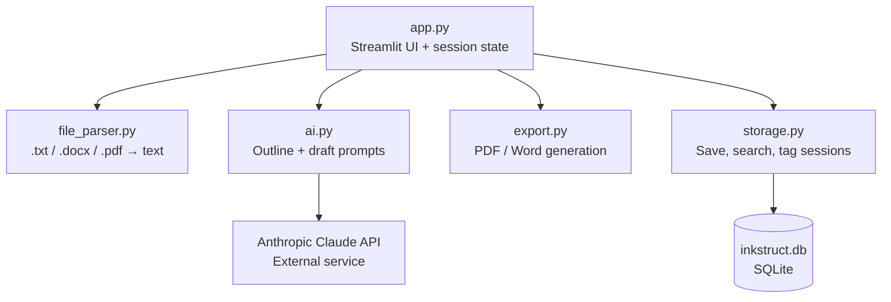
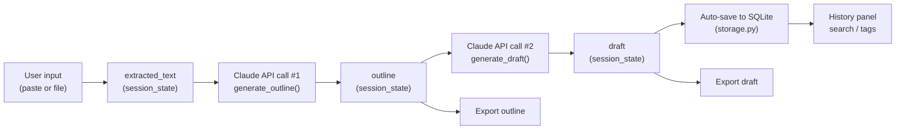
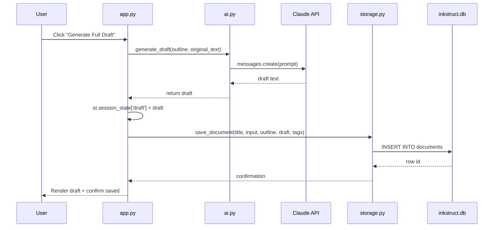

# Inkstruct — System Architecture

Version 1.0 | Day 2 Deliverable | Source of truth for implementation

## 1. Overview

Inkstruct is a single-process Python web application. There is no separate frontend/backend split and no REST API layer — Streamlit renders the UI and runs Python logic in the same process. External communication happens only with the Anthropic Claude API. All persistent data lives in a local SQLite file.

This is intentional and matches the PRD: no accounts, no multi-service architecture, minimal moving parts, buildable in ~1 hour/day.

## 2. Component Diagram

**Module responsibilities:**

| Module | Responsibility | Depends on |
|---|---|---|
| `app.py` | Renders UI, manages `st.session_state`, orchestrates calls to other modules | All modules below |
| `file_parser.py` | Converts uploaded files into plain text | `python-docx`, `pypdf` |
| `ai.py` | Builds prompts and calls the Claude API for outline + draft generation | `anthropic` SDK |
| `storage.py` | Reads/writes SQLite: save, list, search, tag-filter documents | `sqlite3` (built-in) |
| `export.py` | Converts outline/draft text into downloadable PDF/Word files | `python-docx`, `fpdf2` |

No module calls another sideways (e.g. `ai.py` never calls `storage.py` directly) — `app.py` is the only orchestrator. This keeps each module independently testable and easy to reason about within a 1-hour session.

## 3. Data Flow

Data flows in one direction per action — there is no background processing, queue, or async job. Every step is triggered directly by a user click and completes (or errors) before the next step is available.

## 4. Request Lifecycle (a single "Generate Draft" click)

Errors at the Claude API step are caught in `ai.py`/`app.py` and shown as `st.error(...)` — the flow stops there rather than silently continuing to the save step.

## 5. AI Interaction

Two sequential, independent Claude API calls — never one combined call:

1. **Outline generation** — input: raw extracted text. Output: Markdown-formatted outline (headings + sub-bullets). Enforced via a system prompt with explicit formatting instructions.
2. **Draft generation** — input: the outline **and** the original extracted text (so Claude can pull details back in, not just restate headings). Output: full prose draft following the outline's structure.

Keeping these as two calls (rather than one call producing both) makes each step independently re-runnable, keeps prompts focused and reliable, and matches the UI flow (user sees and can stop at the outline stage).

## 6. External Services

| Service | Purpose | Notes |
|---|---|---|
| Anthropic Claude API | Outline + draft generation | Only external network dependency. Key stored in Streamlit secrets, never committed to Git. |
| Streamlit Community Cloud | Hosting | Free tier. Deploys directly from the GitHub repo on push. |
| GitHub | Version control + deployment source | Public repo required for free Streamlit Cloud hosting. |

No other external services are used — no cloud database, no file storage service, no analytics, no auth provider. This is a deliberate scope decision to keep the system understandable and shippable within the time budget.

## 7. Known Architectural Limitation

Streamlit Community Cloud's filesystem is **ephemeral** — `inkstruct.db` resets whenever the app restarts or redeploys. This is accepted for v1.0 (documented in the PRD and Blueprint) since there are no user accounts and this is a capstone demo, not a production multi-user product. Flagged here so it's never mistaken for a bug during Day 9 testing.
