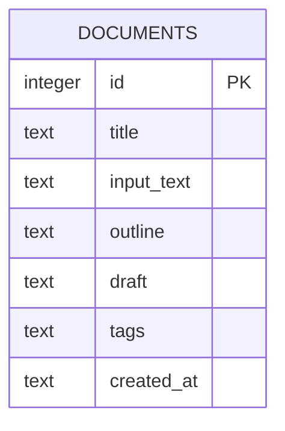

# Inkstruct — Database Schema

Version 1.0 | Day 2 Deliverable | SQLite (local file: `inkstruct.db`)

## 1. Design Rationale

v1.0 has exactly one entity: a saved writing session ("document"). There is no user table (no accounts, per PRD scope), no versioning table (no revision history, per PRD scope), and tags are stored as a simple delimited string rather than a separate join table — a full many-to-many tag schema would be over-engineering for a single-user local tool built in limited time. This can be normalized later if v2 adds multi-user support.

## 2. Entity-Relationship Diagram



Single table, no foreign keys, no relationships — intentionally minimal.

## 3. Table: `documents`

| Field | Type | Constraints | Description |
|---|---|---|---|
| `id` | INTEGER | PRIMARY KEY AUTOINCREMENT | Unique identifier for the session |
| `title` | TEXT | NOT NULL | User-editable title (auto-suggested from input's first few words) |
| `input_text` | TEXT | NOT NULL | The original pasted/uploaded text |
| `outline` | TEXT | NOT NULL | Claude-generated outline (Markdown) |
| `draft` | TEXT | NOT NULL | Claude-generated full draft |
| `tags` | TEXT | NULLABLE | Comma-separated tags, e.g. `"school,essay,history"` |
| `created_at` | TEXT | NOT NULL, default `CURRENT_TIMESTAMP` | ISO timestamp of when the session was saved |

**SQL definition:**

```sql
CREATE TABLE IF NOT EXISTS documents (
    id INTEGER PRIMARY KEY AUTOINCREMENT,
    title TEXT NOT NULL,
    input_text TEXT NOT NULL,
    outline TEXT NOT NULL,
    draft TEXT NOT NULL,
    tags TEXT,
    created_at TEXT NOT NULL DEFAULT CURRENT_TIMESTAMP
);
```

## 4. Query Patterns Needed (drive `storage.py` function design)

| Function | SQL Pattern | Used For |
|---|---|---|
| `save_document(...)` | `INSERT INTO documents (...) VALUES (...)` | Auto-save after draft generation |
| `get_all_documents()` | `SELECT * FROM documents ORDER BY created_at DESC` | Populating the history sidebar |
| `search_documents(keyword)` | `SELECT * FROM documents WHERE title LIKE '%keyword%' OR input_text LIKE '%keyword%' OR draft LIKE '%keyword%'` | Search box |
| `filter_by_tag(tag)` | `SELECT * FROM documents WHERE tags LIKE '%tag%'` | Tag filter dropdown |
| `get_document(id)` | `SELECT * FROM documents WHERE id = ?` | Loading a past session into the main view |

All queries use parameterized SQL (`?` placeholders) to avoid injection — even though this is a local single-user tool, this is a one-line best practice worth keeping.

## 5. Validation Against PRD User Stories

| PRD Requirement | Covered By |
|---|---|
| FR-5: Auto-save each session to persistent local storage | `save_document()` writes all fields including generated content |
| FR-6: List, search, and tag saved sessions | `get_all_documents()`, `search_documents()`, `filter_by_tag()`, `tags` column |
| Core flow step 7: "Session auto-saved with editable title and tags" | `title` and `tags` are both writable/editable fields, not fixed |
| Core flow step 9: "User can revisit... past sessions" | `get_document(id)` retrieves full session content |

No PRD requirement needs a field or table not covered above — schema is validated as sufficient and minimal.

## 6. Explicitly Out of Scope for This Schema

- No `users` table (no auth in v1.0)
- No `versions`/`revisions` table (no draft history in v1.0)
- No separate `tags` join table (simple text field is sufficient for single-user tagging)
- No `updated_at` field (documents are not edited after creation in v1.0 — generate + export only, per PRD)
