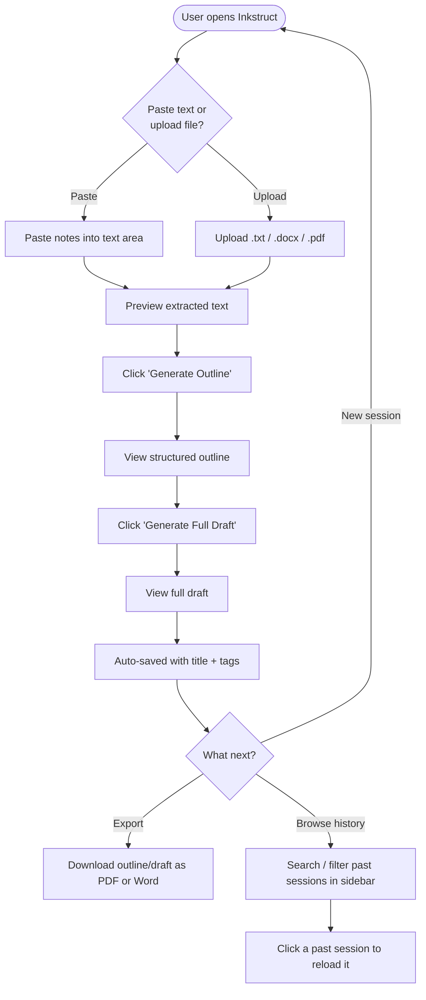
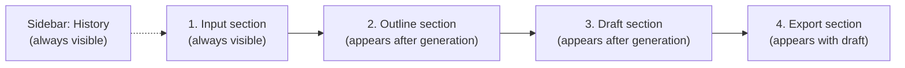

# Inkstruct — UI & User Flow

Version 1.0 | Day 2 Deliverable

## 1. User Flow Diagram



Every screen exists to serve exactly one step of this flow — there is no screen without a clear job (avoids UI scope creep).

## 2. Screen Flow (single-page app — sections, not separate pages)

Because this is a single-page Streamlit app, "screens" are really **sections that appear/expand progressively** as the user completes each step:



This progressive-disclosure approach keeps the UI uncluttered on first load (matches the "clean UI" priority from Day 1) while still reaching full functional depth (export, search, tags) without needing separate pages/routes.

## 3. Low-Fidelity Wireframe — Main Layout

```
┌─────────────────────────────────────────────────────────────────┐
│  INKSTRUCT                                          [Sidebar >] │
├───────────────────────────────────────┬─────────────────────────┤
│                                        │  HISTORY                │
│  ○ Paste Text    ○ Upload File        │  [ Search... ]          │
│                                        │  [ Tag filter ▾ ]       │
│  ┌───────────────────────────────┐    │                         │
│  │  (text area or file uploader) │    │  • Essay on Climate      │
│  │                                │    │    Jul 20 · #school     │
│  └───────────────────────────────┘    │                         │
│                                        │  • Q3 Report Draft       │
│  Preview:                             │    Jul 19 · #work        │
│  ┌───────────────────────────────┐    │                         │
│  │  (read-only extracted text)   │    │  • Blog: AI Tools        │
│  └───────────────────────────────┘    │    Jul 18 · #blog        │
│                                        │                         │
│  [ Generate Outline ]                 │                         │
│                                        │                         │
├────────────────────────────────────────                         │
│  OUTLINE                              │                         │
│  ┌───────────────────────────────┐    │                         │
│  │  1. Heading                   │    │                         │
│  │     - sub-point                │    │                         │
│  │     - sub-point                │    │                         │
│  └───────────────────────────────┘    │                         │
│  [ Generate Full Draft ]  [⬇ PDF] [⬇ Word]                       │
├────────────────────────────────────────                         │
│  DRAFT                                │                         │
│  ┌───────────────────────────────┐    │                         │
│  │  (full generated draft text)  │    │                         │
│  └───────────────────────────────┘    │                         │
│  [⬇ PDF]  [⬇ Word]                    │                         │
│                                        │                         │
│  Title: [___________]  Tags: [______] │                         │
└───────────────────────────────────────┴─────────────────────────┘
```

## 4. Wireframe — Empty State (first load)

```
┌─────────────────────────────────────────────────────────────────┐
│  INKSTRUCT                                                       │
│  Turn scattered notes into structured, finished writing.        │
├───────────────────────────────────────┬─────────────────────────┤
│  ○ Paste Text    ○ Upload File        │  HISTORY                │
│                                        │  No saved documents yet │
│  ┌───────────────────────────────┐    │  Your work will appear  │
│  │  Paste your notes here...     │    │  here automatically.    │
│  └───────────────────────────────┘    │                         │
│                                        │                         │
│  [ Generate Outline ]  (disabled      │                         │
│   until input is provided)            │                         │
└───────────────────────────────────────┴─────────────────────────┘
```

## 5. Wireframe — File Upload Error State

```
┌─────────────────────────────────────────────────────────────────┐
│  ○ Paste Text    ● Upload File                                  │
│  ┌───────────────────────────────┐                              │
│  │  📄 image.png  (unsupported)  │                              │
│  └───────────────────────────────┘                              │
│  ⚠ Couldn't read this file. Supported types: .txt, .docx, .pdf  │
└─────────────────────────────────────────────────────────────────┘
```

## 6. Navigation

There is no multi-page navigation/router in v1.0 — everything lives on one Streamlit page (`app.py`), which matches the PRD's browser-only, no-accounts, single-flow scope. The only "navigation" actions are:

- **Sidebar toggle** (built into Streamlit) to show/hide history
- **Clicking a history item** to reload a past session into the main view (replaces current input/outline/draft in view, does not navigate to a new page)

This keeps the app trivially easy to reason about and matches the 1-hour/day build pace — no routing logic to build or debug.

## 7. Screen-to-Feature Justification (every screen exists for a reason)

| Section | Why it exists | PRD Requirement |
|---|---|---|
| Input section | Core entry point for the product | FR-1, FR-2 |
| Preview | Lets user confirm what will be sent to Claude before spending an API call | UX safeguard, not in FR list but protects trust |
| Outline section | First AI output, core value #1 | FR-3 |
| Draft section | Second AI output, core value #2 | FR-4 |
| Export buttons (x2 locations) | Fulfills export requirement at the natural point of need | FR-7 |
| Sidebar history | Organizing half of the product vision | FR-6 |
| Title/tags fields | Makes saved documents meaningful and findable | FR-6 |

No screen or section exists without a direct line back to a PRD requirement — this is the scope-creep check for the UI layer.
